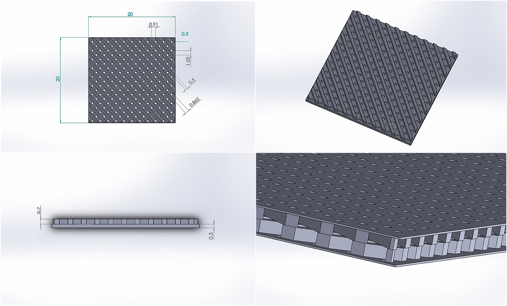
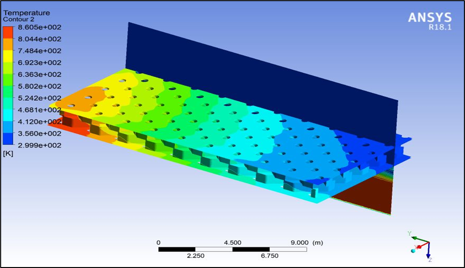

# Matrix Fin-Based Transply Effusion Cooling System (Bachelor Thesis)

## Abstract
The aviation market is expected to achieve a compound annual growth rate of 3% over the forecast period 2019 to 2024 and the manufacturers are looking for efficient jet engines to reduce the fuel consumption which in turn reduces the cost of the travel. The transpiration cooling method has many inherent disadvantages due to its micro sized holes and complexity of manufacturing. In this context, many research works have focused on developing a cooling system which can produce the same effect as transpiration cooling but lesser number of inherent problems. The main objective of this project is to increase the cooling effectiveness of the transply effusion cooling system using matrix fins. The geometric parameters of the matrix fin are optimized using MATLAB software. The optimized parameters are height of the fin is 0.7mm, thickness is 0.5mm, distance between fin array is 0.865mm, angle between top and bottom fin array is 450. These parameters are used to design the matrix fin within the effusion cooling system. The design of the effusion cooling system was taken from the standard designs which are currently in use. The geometric parameters of the holes present in the effusion cooling system are diameter 0.5mm, streamwise pitch 1.03, spanwise pitch 0.91mm. These optimized designs are used to conduct the thermal analysis in ANSYS fluent. The cooling effectiveness of the matrix fin based transply effusion cooling system was calculated using the temperature values that are obtained from the analysis for different conditions of inlet and outlet fluid temperature. For hot gas inlet temperature 500K the values obtained are, maximum temperature 383.315K, minimum temperature 331.22K and the average temperature 356.011K. Similar analysis is conducted on the effusion cooling system with inlet fluid temperature 500K the values obtained are, maximum temperature 425.135K, minimum temperature 334.105K and average temperature equal to 384.966K. To see the effect of increase in the temperature of the combustion chamber the hot fluid inlet temperature is increased to 850K the values obtained are, maximum temperature 417.14K, minimum temperature 319.829K and average temperature 357.612K. The outcome of the analysis was that the cooling system with the matrix fins had better cooling effectiveness than the cooling system without the matrix fins.

## Contents
- Introduction
- Objective
- Theory and Concepts
- Design Optimization
- Numerical Analysis
- Results and Discussion
- Conclusion