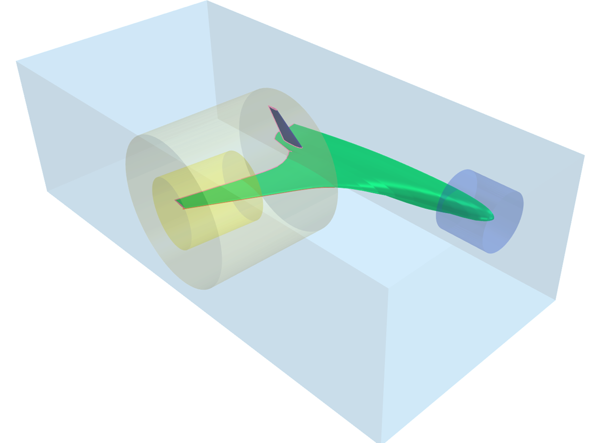
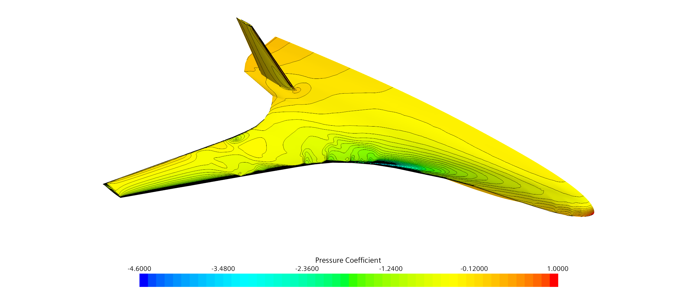

# CFD Report of a Subsonic Study of the NASA N2A Hybrid Wing-Body Using Star-CCM+

## Abstract
A k-ω SST turbulence model in combination with a Polyhedral Mesher approach is used to calculate the effects of subsonic flow (Mach No.=0.2) on the **NASA Hybrid Wing Body** (HWB) aircraft in a simplified N2A configuration (without considering engine nacelles and its effects on the flow simulation). The flow behavior around the body is examined in a cruise configuration, with special focus at the leading edge, trailing edge and the vertical stabilizer. Besides the lift and drag coefficients, the pressure coefficient distribution at different positions of the half span is calculated for various angles of attacks. These results are then compared to experimental wind tunnel data and various study reports. The computed results are in agreement with the experimental data as well as with simulations carried out by other research facilities. However, minor deviations are observed in the magnitude of the lift and drag coefficient as well as major differences in the pressure coefficient distribution over the chord length.

## Contents
- Introduction
- Geometry
- Model Description
- Simulation Results and Discussion
- Conclusion

## Software Used
- Star-CCM+
- CATIA V5
- Microsoft Excel

## Report
For a comprehensive overview of this project, including methodology, results, and analysis, please refer to the [Project Report](./docs/CFD%20Report.pdf).

  

<i>Figure 1: Mesh Optimization Regions</i>

  

<i>Figure 2: Star-CCM+ Pressure Coefficient Visualization</i>

