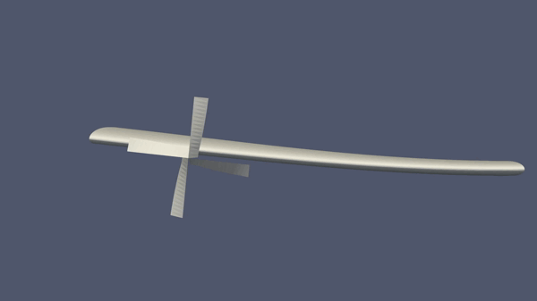

# Aerodynamic Investigation of Propeller-Wing Interaction for Simple Motions and Complex Modes (Master Thesis)

## Abstract
Current research on propeller-wing interaction predominantly examines stationary wing scenarios, avoiding the complexities of wing and propeller motion. This thesis explores the aerodynamic interaction of a propeller-wing system in various motion scenarios using a novel simulation framework called Fluid-Motion Interaction (FMI). The FMI framework couples a mid-fidelity aero solver, **DUST**, with an FMI solver developed in **MATLAB**, validated against theoretical data for pitching and plunging wings and natural modes of the Goland wing, as well as existing research on propeller-wing interaction. Simulations of pitching and plunging wings with a rigidly attached propeller revealed a specific reduced frequency at which aerodynamic performance is maximised. Introducing relative motion between the propeller and wing showed that the aerodynamic response scales with the amplitude ratio of the propeller to the wing and varies linearly with the phase shift of the propeller. Finally, integrating a propeller on the Goland wing at various spanwise positions in the first natural wing modes resulted in a significant lift increase, particularly for the tip-mounted propeller in the first bending mode.

## Contents
- [Introduction]
- [Fundamentals]
- [Simulation Methodology]
- [Validation Studies]
- [Aerodynamic Investigation: Simple Motions]
- [Aerodynamic Investigation: Complex Modes]
- [Conclusion]