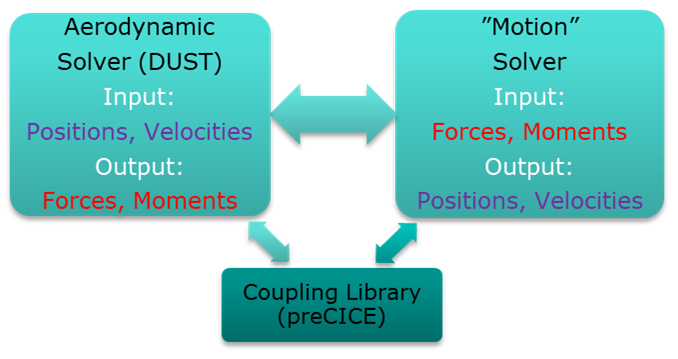

# MATLAB Motion Solver

## Introduction
A structural/motion solver developed in MATLAB to performed partitioned Fluid-Structure Interaction (FSI)/Fluid-Motion Interaction (FMI) Simulations. The solver is coupled with DUST, an aerodynamic open-source solver, by means of an adapter written in Python that contains a coupling library called preCICE. Two types of simulations can be performed:

- Coupled Simulations (under construction): Perform FSI simulations by providing the mass, stiffness and damping matrices of the model, with simulations done using the Newmark (1st order and 2nd order stable), Generalized alpha (2nd order stable) and other methods.
- Prescribed Motion Simulation: Perform FMI simulations by creating a parent-child tree of reference frames, and assigning motions and sub-models to each reference frames. Check user guide and examples on how to perform a prescribed motion simulation.

## Downloads
Read installation guide for preparing and installing the necessary software. Read software versions for latest software version compatibility.